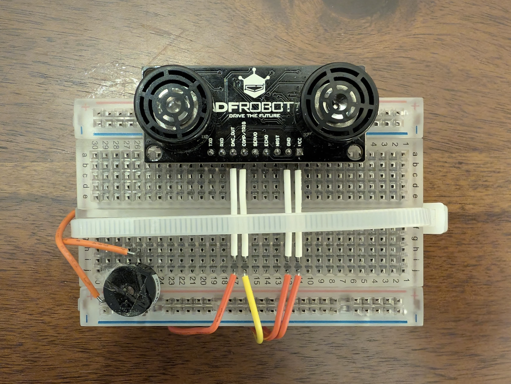
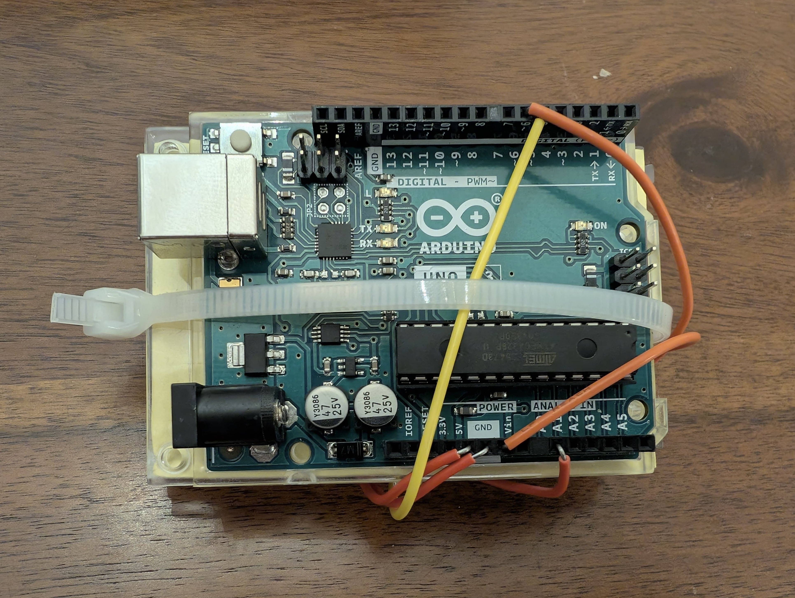

# Ultrasonic Assistive Navigation Device

A real-time assistive navigation system for visually impaired users. 
Combines an ultrasonic sensor, Arduino, a custom real-time IIR filter 
chain, and adaptive buzzer feedback. Built with Python and pyfirmata2.


## Overview

Conventional mobility aids provide limited spatial awareness. This 
system continuously measures obstacle distances, filters noisy sensor 
data through a real-time IIR filter chain, and translates proximity 
into adaptive auditory feedback. Closer obstacles trigger faster beeps. 
Farther obstacles trigger slower beeps. The system runs at 80Hz and 
validates its IIR implementation through unit tests before every run.

## System Architecture
Ultrasonic Sensor (A0)
→ ADC Conversion
→ 4th-order Butterworth IIR Filter Chain (2Hz cutoff)
→ Buzzer Controller (logarithmic beep interval)
→ Real-Time Plot (raw + filtered)

## Key Technical Decisions

| Decision | Rationale |
|---|---|
| 4th-order Butterworth | Maximally flat passband, minimal ripple |
| 2Hz cutoff frequency | Captures human movement, rejects buzzer harmonics and electrical noise |
| Direct Form I IIR | Implemented from scratch, no high-level scipy calls at runtime |
| Logarithmic buzzer scaling | Intuitive proportional response to distance |
| Unit tests before runtime | Programme exits if any of 5 tests fail, guaranteeing filter correctness |

## Results

| Metric | Result |
|---|---|
| Effective sampling rate | ~83Hz (vs 80Hz target) |
| Unit tests | 5 of 5 passed across impulse, step, and noisy signal cases |
| Noise reduction | High-frequency noise and buzzer harmonics eliminated |
| Buzzer response | Accurately reflects obstacle proximity in real time |

## Unit Tests

Five tests validate the custom IIR implementation against scipy's 
sosfilt before every run:

- Single SOS impulse response
- Single SOS step response
- Filter chain impulse response
- Filter chain step response
- Filter chain noisy signal response

## Hardware

| Component | Specification |
|---|---|
| Microcontroller | Arduino UNO R3 |
| Ultrasonic Sensor | URM37 DFRobot |
| Buzzer | Active buzzer |

**Pin mapping:** A0 (sensor), D5 (trigger), D6 (buzzer), 5V/GND

## Device




## Installation

```bash
pip3 install pyfirmata2 numpy matplotlib scipy
```

Upload StandardFirmata to your Arduino via the Arduino IDE.

## Usage

```bash
python3 main.py
```

Unit tests run automatically. If all pass, real-time processing 
begins. Two windows display raw and filtered distance data live.

## Files

| File | Description |
|---|---|
| main.py | Full Python source code |
| IIR-Assistive-Navigation-Report.pdf | Technical report (PDF) |
| IIR-Assistive-Navigation-Report.docx | Technical report (Word) |
| device-front.jpg | Device, front view |
| device-back.jpg | Device, back view |

## Author

**Adeem Azad**
BEng Mechatronics, University of Glasgow
[LinkedIn](https://www.linkedin.com/in/adeem-azad)
